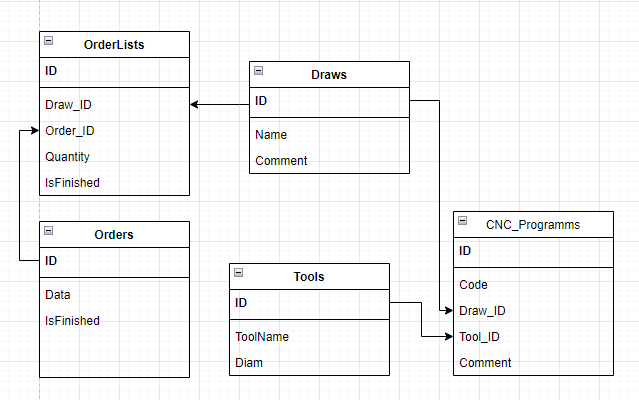
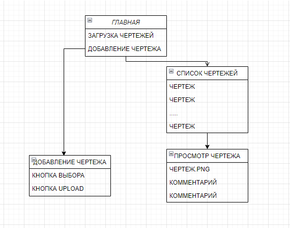
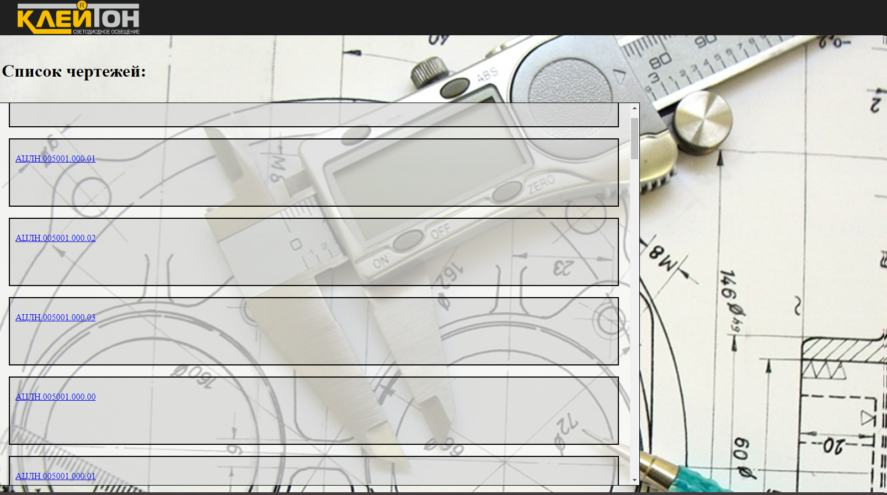
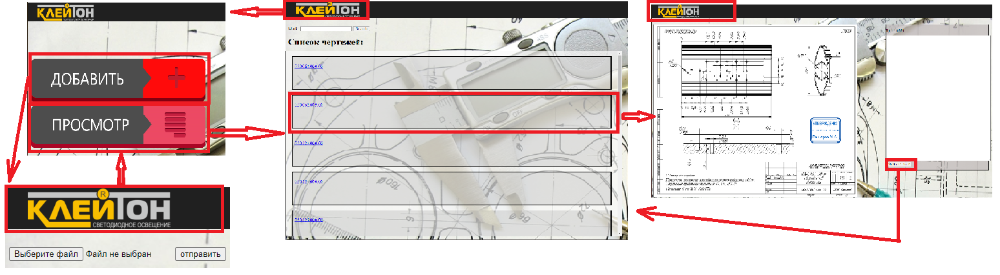

1Итак, скачиваем Visual Studio code с официального сайта https://code.visualstudio.com/, выбрав версию, соответствующую нашей ОС. В моем случае это версия под

64 разрядную версию Windows и запускаем установщик. Опции предлагаемые установщиком по умолчанию нас вполне устраивают.

Настройка редактора:

Запустим редактор, и пропустим приветственное окно. Внизу на панели действий шестерёнка, нажав на которую выберем пункт Settings, далее справа ввреху можно нажать

на иконку open settings.JSON и открыть файл с настройками IDE settings.JSON, в который внесем все необходимые настройки, отличные от базовых:
```
{

"extensions.autoCheckUpdates": false,

"update.enableWindowsBackgroundUpdates": false,

"extensions.autoUpdate": false,

"update.showReleaseNotes": false,

"update.mode": "none",

"debug.inlineValues": "on",

"debug.autoExpandLazyVariables": true,

"editor.minimap.enabled": false,

"workbench.colorTheme": "Monokai",

"terminal.integrated.cursorStyle": "line",

"terminal.integrated.cursorBlinking": true,

"window.commandCenter": false,

"workbench.startupEditor": "none",

"files.autoSave": "afterDelay",

"explorer.autoReveal": false,

"explorer.compactFolders": false,

"breadcrumbs.enabled": false,

"terminal.integrated.defaultProfile.windows": "Command Prompt"

}
```

Первый блок - отключим автообновление IDE, когда понадобится обновить редактор это легко сделать вручную.
Далее - Minimap. Это схема документа справа, для удобства я ее отключаю, чтобы получить больше рабочего пространства.
Затем строка "workbench.colorTheme": "Monokai" устанавливает рабочую тему Monokai.
Далее идут настройки терминала - зесь меняем вид курсора, вместо кравдарта устанавливаю мигающую линию,
также вместо проблемного PowerShell использую стандартную командную строку Windows(чтобы не заниматься настройками правил безопасности для неподписанных скриптов):
"terminal.integrated.defaultProfile.windows": "Command Prompt"
Убираем стартовое окно и командный центр вверху экрана.
Включаю автосохранение файлов: "files.autoSave": "afterDelay"
Настраиваю отображение папок в навигационной панели: "explorer.autoReveal": false, "explorer.compactFolders": false
В общих настройках отключаем хлебные крошки(вверху подсказка, показывающая путь к файлу)
Это все что касается базовых настроек IDE. 
Сохраняю файл settings.JSON. Также можно сохранить его где-нибудь отдельно, например на GitHub, чтобы потом при переустановке не прводить повторную настройку.

**Установка и настройка плагинов для Python**
- **Расширение Python от Microsoft** - линтер, отладка, навигация по коду, форматирование кода, рефакторинг и многое другое.
Оно автоматически подтягивает расширение Pylance, которое работает вместе с Python в коде Visual Studio для обеспечения эффективной языковой поддержки.


*******************************************************************************************

**База данных**

Первоначально была запланирована следующая структура БД:



Здесь в таблице `Draws` хранятся чертежи и комментарии к ним, в таблице `Orders` - номера заказов с флагом - завершен ли заказ.
Так как в одном заказе может быть несколько деталей и одна деталь может быть в нескольких заказах дополнительно создается таблица `OrderLists`, связывающая эти 2 таблицы, в которой будут содержаться отдельные пункты каждого заказа, их количество и флаг завершения пункта заказа. При завершении всех пунктов заказа флаг в таблице заказов будет проставляться автоматически.

Таблица `Tools` содержит информацию о используемых инструментах. Таблица `CNC_Programms` содержит информацию по программам обработки для каждого из чертежей деталей. Одна деталь может обрабатываться не одной, а несколькими программами, с разными обрабатывающими инструментами, что отражают связи. 
Однако возникли вопросы - нужна ли таблица для оснасток, таблица исполнителей заказа. Поэтому было принято решение в тестовой версии ограничиться одной таблицей, состоящей из полей "имя чертежа" и "комментарий", чтобы потом проанализировать комментарии и с их учетом уже разработать структуру базы данных. Также к этому времени будет принято решение дополнять ли программу работой с заказами, и нужно ли будет в этом случае фиксировать исполнителя заказа.

Таким образом для начала принято рещшение остановиться на создании простейшей БД из 1 таблицы с полями "название чертежа" и "комментарий" 


**Структура программы**



На рисунке изображена структура нашего приложения.
С главного экрана мы попаем либо на страницу загрузки чертежей, либо на страницу их просмотра.


**Верстка шаблонов**

Для верстки шаблонов будем использовать так называемую контейнерную верстку. Содержимое будет размещено в некоем элементе, ширина которого, ограничивающая ширину содержимого, позволяет пользователям удобно работать с материалами сайта и обеспечит хорошее отображение всех элементов на разных устройствах. Такие элементы называют «обёртками» (wrapper) или «контейнерами» (container). Затем эти контейнеры будут стилизованы средствами CSS для правильного отображения.

Преимущества такого типа верстки состоят например в том, что
- Использование контейнера улучшает читабельность содержимого страницы. Без контейнера содержимое, вроде текста, может растягиваться на всю ширину экрана. На маленьких экранах подобное может давать вполне приемлемый результат. Но на больших экранах это выглядит очень плохо.
- Группировка элементов дизайна страницы упрощает настройку расстояния между ними.
- Элементы дизайна  сложно сгруппировать по столбцам без использования контейнера.


**Практическая часть**

Создадим Django проект:
```
django-admin startproject hello-django
```
и в нем новое приложение details:
```
python manage.py startapp details
```


Подготовим таблицу БД. Создадим файл `models.py`
```
class Draws(models.Model):
    name = models.CharField(max_length=13)
    comment = models.TextField(blank=True)
    time_create = models.DateTimeField(auto_now_add=True)
    time_update = models.DateTimeField(auto_now=True)

    def __str__(self):
        return self.name
```

**Контейнеризация**  

Так как было принято решение о том, что приложение будет разворачиваться в контейнере Docker, а также в учебных целях было принято решение изначально запускать и создавать приложение с использованием контейнеризации.

Таким образом понадобится два варианта образов приложения - для разработки и для продакшена.
Одним из плюсов такого подхода будет то, что мы сможем сразу поменять `settings.py` таким образом, чтобы он бьл универсальным и получал важные параметы из переменных окружения:

```
from os import environ

SECRET_KEY = environ.get('SECRET_KEY')
DEBUG = int(environ.get('DEBUG', default=0))
ALLOWED_HOSTS = environ.get('ALLOWED_HOSTS').split(' ')
```

Подключим базу данных под управлением СУБД PostgreSQL:

```
DATABASES = {
    'default': {
        'ENGINE': environ.get('POSTGRES_ENGINE', 'django.db.backends.sqlite3'),
        'NAME': environ.get('POSTGRES_DB', BASE_DIR / 'db.sqlite3'),
        'USER': environ.get('POSTGRES_USER', 'user'),
        'PASSWORD': environ.get('POSTGRES_PASSWORD', 'password'),
        'HOST': environ.get('POSTGRES_HOST', 'localhost'),
        'PORT': environ.get('POSTGRES_PORT', '5432'),
    }
}
```
Зададим пути для статических файлов:

```
# То как статический файл будет отображаться в url
# Пример /static/1.jpg
STATIC_URL = "/static/"
# По какому пути можно будет найти файлы
STATIC_ROOT = BASE_DIR / "static"

# Аналогично static файлам
MEDIA_URL = "/media/"
MEDIA_ROOT = BASE_DIR / "media"
```

Подготовим `docker` и `docker-compose` файлы.

`Dockerfile` 

```
FROM python:3.8.6-alpine

# рабочая директория внутри проекта
WORKDIR /usr/src/app

# переменные окружения
ENV PYTHONDONTWRITEBYTECODE 1
ENV PYTHONUNBUFFERED 1

# Устанавливаем зависимости для Postgre
RUN apk update \
    && apk add postgresql-dev gcc python3-dev musl-dev

# устанавливаем зависимости
RUN pip install --upgrade pip
COPY ./requirements.txt .
RUN pip install -r requirements.txt

# копируем содержимое текущей папки в контейнер
COPY . .

ENTRYPOINT ["/usr/src/app/entrypoint.sh"]
```

где `entrypoint.sh` скрипт нужен чтобы дать загрузиться СУБД и применить миграции:

```
#!/bin/sh

if [ "$DATABASE" = "postgres" ]
then
    # если база еще не запущена
    echo "DB not yet run..."

    # Проверяем доступность хоста и порта
    while ! nc -z $POSTGRES_HOST $POSTGRES_PORT; do
      sleep 0.1
    done

    echo "DB did run."
fi
# Удаляем все старые данные, чтобы сохранить данные
python manage.py flush --no-input
# Выполняем миграции
python manage.py migrate

exec "$@"
```

`docker-compose.yml` 

```
version: '3.8'

services:
  web:
    build: ./app
    command: python manage.py runserver 0.0.0.0:8000
    volumes:
      - ./app/:/usr/src/app/
    ports:
      - 8000:8000
    env_file:
      - ./.env.dev
    depends_on:
      - db  

  db:
    # Образ и версия базы, которую мы будем использовать
    image: postgres:12.0-alpine
    # Внешний том(volume) и место где он будет подключен внутри контейнера
    volumes:
      - postgres_volume:/var/lib/postgresql/data/
    environment:
      # Учетные данные(их пример):
      - POSTGRES_USER=user
      - POSTGRES_PASSWORD=password
      - POSTGRES_DB=my_db

volumes:
  postgres_volume:
```

Здесь мы создаем 2 контейнера: с Django на порту 8000, который пробрасываем наружу, подгружаем переменные окружения из файла `.env.dev` и контейнер с Postgre. Если не описывать volume для контейнера с базой, каждое пересоздание контейнера приведет к уничтожению базы и данных. Поэтому мы описали создание внешнего тома Docker `postgres_volume`, который будет хранить данные на случай пересоздания контейнера.

Файл с переменными окружения `.env.dev`:

```
DEBUG=1
SECRET_KEY=my_topsecret_key
ALLOWED_HOSTS=localhost 127.0.0.1 [::1]
DATABASE=postgres
POSTGRES_ENGINE=django.db.backends.postgresql
POSTGRES_DB=django_db
POSTGRES_USER=user
POSTGRES_PASSWORD=password
POSTGRES_HOST=db
POSTGRES_PORT=5432
```
Для запуска сервера достаточно выполнить команду:
```
docker-compose up -d --build
```
которая соберет и поднимет контейнеры на основании инструкций в `Dockerfile` и `docker-compose.yml`
Теперь можно открыть `http://127.0.0.1` и убедиться что проект работает. 

Выполним миграции в БД:
```
docker-compose exec web python manage.py migrate --noinput
```

**Статические файлы**  

Веб-сайты обычно должны обслуживать дополнительные файлы, такие как изображения, JavaScript или CSS. В Django эти файлы называются «статическими файлами». Django предоставляет `django.contrib.staticfiles` для управления ими во время разработки. 
В нашем приложении будут использоваться картинки, а также различные css стили для форматирования страниц.
Настроим обслуживание статических файлов в нашем проекте:
1. Убедимся, что `django.contrib.staticfiles` включено в `INSTALLED_APPS` в файле settings.py:
```
INSTALLED_APPS = [
    "django.contrib.admin",
    "django.contrib.auth",
    "django.contrib.contenttypes",
    "django.contrib.sessions",
    "django.contrib.messages",
    "django.contrib.staticfiles",

    "upload", "details",
]
```
2. Также убедимся в наличии строки:
```
STATIC_URL = '/static/'
```
если она отсутствует, ее следует добавить.
3. Поместим статические файлы в папку static приложения, где Django по умолчанию будет искать статические файлы:  
```
app/details/static/details/
```
Если бы в нашем проекте, были статические элементы, не связанные с конкретным приложением, нужно было бы, помимо использования каталога static/ в ваших приложениях, определить список каталогов ( STATICFILES_DIRS ) в файле настроек, сообщающий Django, где он может найти другие статические файлы. Например :
```
STATICFILES_DIRS = [
    BASE_DIR / "static",
    '/var/www/static/',
]
```
Однако так как на данном этапе мы ограничимся одним приложением в проекте, эта опция пока не нужна.

**Формы**

Подготовим формы для представлений в файле `forms.py`
```
class SearchForm(forms.Form):
    mask = forms.CharField(max_length=13,required=False)

class DrawForm(forms.Form):
    comment = forms.CharField(widget=forms.Textarea(attrs={'cols':75, 'rows':38}), label='', required=False)
```


**Представления**

Для каждого из 4 окон приложения создадим представления в файле `views.py`

В представлении для просмотра списка чертежей реализуем фильтрацию, с помощью получаемой из формы маски фильтрации:
```
mask_name = request.POST['mask']
acln = list(Draws.objects.filter(name__contains=mask_name))
```

В представлении для просмотра чертежа с комментарием реализуем переход обратно в список чертежей с сохранением комментария в БД:
```
def number(request, specification):
    drw_obj = Draws.objects.get(name=specification)
    form = DrawForm(initial={'comment':drw_obj.comment})


    if request.method == "POST":
        drw_obj.comment = request.POST['comment']
        drw_obj.save()
        return redirect('details')
```        

В представлении для загузки чертежей сохряняем в базу только чертежи, соответсвующие формату имени:
```
def image_upload(request):
    if request.method == "POST" and request.FILES["image_file"]:
        image_file = request.FILES["image_file"]
        fs = FileSystemStorage()
        filename = fs.save(image_file.name, image_file)
        image_url = fs.url(filename)
        print(image_url)
        image_name = '.'.join(image_url.split('.')[:-1]).split('/')[-1]
        img_ext = image_url.split('.')[-1]
        if re.fullmatch(r'[0-9]{6}\.[0-9]{3}\.[0-9]{2}', image_name)and img_ext=='png':
           img_name = f'{image_name} is ok name'
           drw_obj, is_created = Draws.objects.get_or_create(name=image_name)
           drw_obj.save()
           
        else:
            image_name = f'Name Error: {image_name}'
               
        return render(request, "details/upload.html", {
            "image_url": img_name
        })

    return render(request, "details/upload.html")
```

**Шаблоны**

**Шаблоны (templates) отвечают за формирование внешнего вида приложения.** Они предоставляют специальный синтаксис, который позволяет внедрять данные в код HTML.

Настройка функциональности шаблонов в проекте Django производится в файле settings.py. с помощью переменной TEMPLATES. Так, по умолчанию переменная TEMPLATES в файле settings.py имеет следующее определение:
```
TEMPLATES = [
    {
        'BACKEND': 'django.template.backends.django.DjangoTemplates',
        'DIRS': [],
        'APP_DIRS': True,
        'OPTIONS': {
            'context_processors': [
                'django.template.context_processors.debug',
                'django.template.context_processors.request',
                'django.contrib.auth.context_processors.auth',
                'django.contrib.messages.context_processors.messages',
            ],
        },
    },
]
```

Данная переменная принимает список конфигураций для каждого движка шаблонов. По умолчанию определена одна конфигурация, которая имеет следующшие параметры

BACKEND: движок шаблонов. По умолчанию применяется встроенный движок django.template.backends.django.DjangoTemplates

DIRS: определяет список каталогов, где движок шаблонов будет искать файлы шаблонов. По умолчанию пустой список

APP_DIRS: указывает, будет ли движок шаблонов искать шаблоны внутри папок приложений в папке templates.

OPTIONS: определяет дополнительный список параметров

Итак, в конфигурации по умолчанию параметр APP_DIRS имеет значение True, а это значит, что движок шаблонов будет также искать нужные файлы шаблонов в папке приложения в каталоге templates. То есть по умолчанию мы уже имеем настроенную конфигурацию, готовую к использованию шаблонов. Теперь определим сами шаблоны.

Добавим в папку приложения каталог templates. В нем создадим папку Details, таким образом мы сможем в дальнейшем отличать шаблоны с одинаковыми именами созданные в разных приложениях. 
Создадим базовый шаблон base.html, который будет главной страницей приложения и от которого будут наследоваться остальные шаблоны:

```

<!DOCTYPE html>
<html lang="en">
<head>
  
  <meta charset="UTF-8">
  <meta name="viewport" content="width=device-width, initial-scale=1.0">
  <link rel="stylesheet" href="">
  <title>Doc</title>
  
</head>
<body>

<header>
  
</header>


content


<footer>
OOO "Клейтон" 2024
</footer>

</body>
</html>
```

Это практически обычная веб-страница, которая содержит код html, за несколькими небольшими отличиями.

1.  ****   
Строка `` необходима для ссылки на статические файлы в таких элементах, как `<head>` и `<body>`. В примере, показанном в этом разделе, под "статическими файлами" понимается набор пользовательских тегов шаблонов Django, который позволяет ссылаться на статические файлы с помощью синтаксиса ``.
2. ****  
Здесь происходит подстановка префикса, который указан в файле настроек, для определения полного пути к статическим файлам.
3. Блок
```

content

```
Основная фишка шаблонов Django — наследование. Шаблон может расширять (уточнять) поведение родительского шаблона. В данном случае наш базовый шаблон base.html будет расширяться дочерними шаблонами. 
Участок шаблона обернутый в блочный тег ` ` в шаблоне наследнике может быть переопределен так, как нам будет нужно.
По сути наследование шаблонов позволяет реализовать принцип DRY(dont repeat yourself).

Взглянем, каким образом происходит наследование, а также посмотрим на другие тонкости работы с шаблонами:
```


{{title}}

 
<div class="title_text">
<h1>{{content}}</h1>
</div>
<div class="wrapper">
  <div class="scroll">
    
    <a href = >
    
      <div class="container">
        
        <p class="info">{{number}}</p>      
      </div>

  </a>
     
  </div>
</div>  
  
``` 
Рассмотрим шаблон info.thml подробнее:
`` говорит о том, что этот шаблон расширяет наш базовый шаблон. Также в него из соответствующего метода view был передан ряд переменных:
- title - строка, содержащая заголовок страницы и подставляемая в блок заголовка title. Чтобы получить доступ к значению переменной ее имя оборачивается двойными фигурными скобками.
- content - заголовок для отображения на странице
- acln - список чертежей. который перебирается в цикле, где генерируется отображение названий чертежей в виде списка:



Также стоит разобрать, что происходит в конструкции вида:  
``  
 тег  служит для генерации URL-адресов для представлений или шаблонов именованных URL-адресов, определенных в конфигурации URL проекта Django. Этот тег позволяет создавать динамические URL-адреса в шаблонах. Здесь в цикле создаются динамические url адреса для каждого из чертежей, где `"number"` - название функции view, отвечающей за эту ссылку, а
 `number` - первеменная цикла, которую мы передаем в эту функцию, для генерации url  


**Деплоймент**
Для успешного деплоймента проекта понадобится собрать 3 контейнера: 
- приложение Django под Gunicorn
- СУБД PostgreSQL
- сервер ngnix для отдачи статики

Итак переработаем Dockerfile следующим образом:

```
###########
# BUILDER #
###########

# pull official base image
FROM python:3.11.4-slim-buster as builder

# set work directory
WORKDIR /usr/src/app

# set environment variables
ENV PYTHONDONTWRITEBYTECODE 1
ENV PYTHONUNBUFFERED 1

# install system dependencies
RUN apt-get update && \
    apt-get install -y --no-install-recommends gcc

# install python dependencies
COPY ./requirements.txt .
RUN pip wheel --no-cache-dir --no-deps --wheel-dir /usr/src/app/wheels -r requirements.txt


#########
# FINAL #
#########

# pull official base image
FROM python:3.11.4-slim-buster

# create directory for the app user
RUN mkdir -p /home/app

# create the app user
RUN addgroup --system app && adduser --system --group app

# create the appropriate directories
ENV HOME=/home/app
ENV APP_HOME=/home/app/web
RUN mkdir $APP_HOME
RUN mkdir $APP_HOME/staticfiles
RUN mkdir $APP_HOME/mediafiles
WORKDIR $APP_HOME

# install dependencies
RUN apt-get update && apt-get install -y --no-install-recommends netcat
COPY --from=builder /usr/src/app/wheels /wheels
COPY --from=builder /usr/src/app/requirements.txt .
RUN pip install --upgrade pip
RUN pip install --no-cache /wheels/*

# copy entrypoint.prod.sh
COPY ./entrypoint.prod.sh .
RUN sed -i 's/\r$//g'  $APP_HOME/entrypoint.prod.sh
RUN chmod +x  $APP_HOME/entrypoint.prod.sh

# copy project
COPY . $APP_HOME

# chown all the files to the app user
RUN chown -R app:app $APP_HOME

# change to the app user
USER app

# run entrypoint.prod.sh
ENTRYPOINT ["/home/app/web/entrypoint.prod.sh"]


```

 Builder - это временный образ с помощью которого будут созданы бинарные файлы Python. После создания образа builder с него будут скопированы файлы в наш основной образ.

 В процессе настройки мы также создаем пользователя и приложение app. Такая процедура необходима, чтобы избежать использования пользователя ‘root’, который Docker использует по умолчанию. Сохраним его как `Dockerfile.prod`

Изменим файл `docker-compose.yml` и сохраним его как `docker-compose.prod.yml`
version: '3.8'

```
services:
  web:
    build:
      context: ./app
      dockerfile: Dockerfile.prod
    # Запускаем сервер gunicorn  
    command: gunicorn hello_django.wsgi:application --bind 0.0.0.0:8000
    # Подключаем статические и медиа файлы
    volumes:
      - static_volume:/home/app/web/staticfiles
      - media_volume:/home/app/web/mediafiles
     # Пробрасываем наружу порт 8000  
    expose:
      - 8000
    env_file:
      - ./.env.prod
    depends_on:
      - db
  db:
    image: postgres:15
    volumes:
      - postgres_data:/var/lib/postgresql/data/
    env_file:
      - ./.env.prod.db
  nginx:
    build: ./nginx
    volumes:
      - static_volume:/home/app/web/staticfiles
      - media_volume:/home/app/web/mediafiles
    ports:
      - 1337:80
    depends_on:
      - web

volumes:
  postgres_data:
  static_volume:
  media_volume:
```

Также правим скрипт запуска БД:
```
#!/bin/sh

if [ "$DATABASE" = "postgres" ]
then
    echo "Waiting for postgres..."

    while ! nc -z $SQL_HOST $SQL_PORT; do
      sleep 0.1
    done

    echo "PostgreSQL started"
fi

exec "$@"
```
Конфигурируем ngnix
Создадим папку ngnix в корне проекта, добавим файл конфигурации `nginx/nginx.conf`:
```
{upstream hello_django {
    server web:8000;
}

server {

    listen 80;

    location / {
        proxy_pass http://hello_django;
        proxy_set_header X-Forwarded-For $proxy_add_x_forwarded_for;
        proxy_set_header Host $host;
        proxy_redirect off;
    }

    location /static/ {
        alias /home/app/web/staticfiles/;
    }

    location /media/ {
        alias /home/app/web/mediafiles/;
    }

}
}
```
И `Dockerfile` для ngnix:

```
FROM nginx:1.25

RUN rm /etc/nginx/conf.d/default.conf
COPY nginx.conf /etc/nginx/conf.d
```
Добавим файл переменных окружения для продакшена .env.prod(указав свои значения для логина, пароля и токена):
```
!!!!!!!!!!!!!!!!!!!!!!!!!!!!!!!!!!!!!!!!!!
```

Разворачиваем проект с помощью команд:

```
docker-compose -f docker-compose.prod.yml up -d --build
docker-compose -f docker-compose.prod.yml exec web python manage.py migrate --noinput
docker-compose -f docker-compose.prod.yml exec web python manage.py collectstatic --no-input --clear
```
Так как порты до 1000 могут слушать только приложения под Root можно настроить перенаправление портов:
```
!!!!!!!!!!!!!!!!!!!!!!!!!!!!!!!!!!!!!!!!!!!!!
```


**Выводы и результаты тестов**  

В ходе тестового периода эксплуатации было выявлено:
1. Для некоторых деталей существует больше 1 листа чертежей, соответственно надо доработать структуру хранения на диске и в БД и изменить представление для показа чертежей.
2. Для обработки одной детали может быть больше 1 программы, соответственно нужна таблица управляющих программ, связанная с таблицей чертежей.
3. Нужна таблица для оснасток, которая бы хранила информацию о оснастках, программах для их изготовления.
4. Нужно также хранить информацию о cam файле, в котором хранится модель и разработанная по ней УП, для того чтобы можно было скорректировать УП при необходимости. 
5. Нужно добавлять новое приложение для работы с заказами. Это отдельная большая задача, требующая проработки с самого начала - со структуры БД и экранов программы, тестового периода и дальнейшей доработки.
6. Нужно добавить учет расхода материала, чтобы упросить ежемесячный переучет остатков материала и сверку по материалу.
7. Мобильная версия требует отдельной верстки с измененным и сокращенным порядком элементов.
Данное приложение было внедерно в ООО "Клейтон", на данный момент разрабатывается новая версия с учетом выявленных новых вводных требований.


**ПРИЛОЖЕНИЯ**
1. Демонстрационая версия приложения (с ограниченной БД) находится по адресу http://led-cnc.ru/details
2. Навигация. Карта приложения:



**Литература**
1. Django Project Docs.  Retrieved from https://docs.djangoproject.com/en/4.2/ (in English)
2. “Хабр” (2008). Название статьи: “Шаблоны Django. Наследование.” Автор: Павел Довбуш Ссылка: https://habr.com/ru/articles/23132/
3. "Проброс и перенаправление портов в iptables" Автор: Roman Bogachev Retrieved from https://bogachev.biz/2016/01/13/probros-i-perenapravlenie-portov-v-iptables/
4. Dockerizing Django Application: How to Containerize Python Web App  (in English)
5.  Author: Hitesh Jethva Retrieved from https://cloudinfrastructureservices.co.uk/dockerizing-django-application-how-to-containerize-python-web-app/  (in English)
